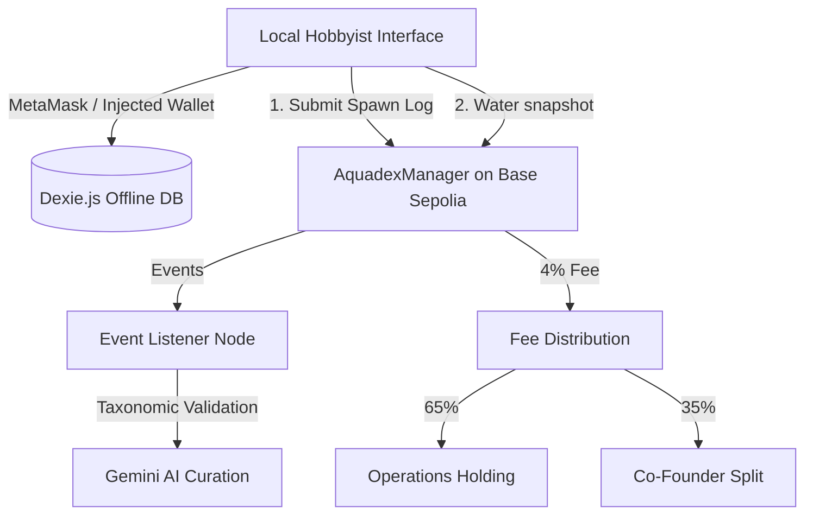

# Aquadex Protocol (Aquacellum) — Project Specification
### Source of Truth for Decentralized Biological Provenance & Distributed Telemetry on Base L2

---

## 1. Executive Summary & Vision

The **Aquadex Protocol** (Aquacellum) is an open-source biological provenance framework designed to map, track, and preserve aquatic biodiversity in captive environments. It combines an immutable blockchain lineage ledger (ERC-721 specimen logs on Base L2) with local-first operational tools for professional breeders and casual hobbyists.

By bridging hobbyist fishkeeping registries with professional breeding standards, Aquadex addresses the data gap in captive-bred genetic diversity and micro-ecosystem water chemistry.

### Core Value Anchors
- **Immutable Provenance**: Un-falsifiable ancestry trees (Sire/Dam indices) tracing specimens across generations, with inbreeding coefficient detection.
- **Account Abstraction & Embedded Wallets**: Seamless onboarding via Privy embedded MPC wallets (email/Google login). MetaMask available as fallback for advanced users. Gasless beta via server-side relayer.
- **Local-First Architecture**: Dexie.js offline database with TanStack Query caching. All operational data (tanks, action logs, grow-out tracking, photos) works without network. On-chain registration deferred to "publish" step.
- **Dual-Mode Experience**: Casual Hobbyist mode (friendly, gamified) and Pro Breeder mode (operational, de-gamified) driven by a single toggle.
- **Narrative Onboarding**: 4-step wizard guided by Poseidon (AI assistant) introducing users to their companion (Echo), creating their identity, and registering their first tank — all while the species database loads in the background.
- **Poseidon AI Intelligence Layer**: Gemini 2.0 Flash-powered freshwater fish expert, grounded via RAG in the curated 326-species catalog. Provides natural language search, spawn thread narration, species compatibility advice, image alt-text generation, and contextual Q&A — all routed through server-side Edge Functions with structured JSON responses. User-controllable via Settings toggle.
- **Social Layer (The Reef)**: Full social backbone with profiles, Tank Currents feed, reactions, comments, Tankmate connections, Schools (clubs), Expert Audits, mentorship pairing, Tides (live events with GPS maps, auctions, real-time chat), and push notifications via Web Push VAPID.

### Protocol Fee Structure (Current — Testnet)
- **Total fee**: 4% of transaction price (`TOTAL_FEE_BPS = 400`)
- **Split**: 65% to operations holding wallet / 35% split equally among 3 co-founder slots
- **In-event zone**: Reduced to 2% for transactions inside active expo zones
- **Note**: Fee routing addresses are testnet placeholders. Production will route to marine conservation treasury and ecosystem fund.

### Governance & Curation (Current State)
- **Species catalog curation**: Curator-only (`onlyCurator` modifier). Single curator address hardcoded to project director's wallet.
- **Governance contract**: `AquadexGovernance.sol` is deployed and functional (proposal/vote/execute pattern using specimen NFTs as voting tokens) but **not active** for species additions. The curator bypass is the current operational path.
- **Council members**: 3 co-founders hold `COUNCIL_MEMBER_ROLE` on the marketplace contract. No outside members yet.
- **Future**: Community governance voting will be activated once the catalog stabilizes and sufficient specimen NFTs are distributed.

---

## 2. System Architecture



### Infrastructure Components
1. **Frontend Client**: Multi-page Vite React app (`index.html` landing, `app.html` dashboard) with glassmorphic UI.
2. **Base L2 Smart Contracts**: Registry transactions, pedigree state transitions, escrow/shipping, batch checkout.
3. **FishBase Master Catalog**: Offline JSON (`fishbase_master.json`) — 326 species with taxonomic envelopes (temp/pH/volume bounds).
4. **Local Database**: Dexie.js v10 schema with tables: `species`, `listings`, `tanks`, `actionLogs`, `userProfile`, `breederCompanion`, `pendingHandshakes`, `speciesManifest`, `spawnGrowout`, `feedCache`, `socialNotifications`, `draftContent`.
5. **Serverless API**: Vercel serverless functions for species suggestion validation (WoRMS + Gemini AI audit), transaction relayer, and Poseidon AI gateway.
6. **Poseidon AI Gateway**: `/api/poseidon` (Gemini 2.0 Flash) — structured JSON responses, RAG-grounded in 326-species catalog, multi-turn context, rate-limited (20/hr). Additional endpoints: `/api/parse-search` (NL query parsing), `/api/generate-alt-text` (Gemini Vision for accessibility).
7. **Social Backend**: Supabase Postgres (19 tables with RLS + notification triggers + cron), Supabase Storage (media CDN), Supabase Realtime (live chat + notifications), 2 Edge Functions (tide-lifecycle, send-push), Web Push via VAPID.
8. **Beta Relayer**: `/api/relay-transaction` — server-side transaction signing for on-chain writes using a single funded deployer wallet. Beta testers never interact with MetaMask.

---

## 3. Smart Contracts

All contracts deployed on **Base Sepolia (Chain ID 84532)**.

| Contract | Address | Purpose |
|----------|---------|---------|
| AquadexManager | `0x351ca8f34D94F29F6f865Afa419A636324473DeF` | Registry, specimens, tanks, spawns, species catalog |
| AquadexMarketplace | `0x16168B514144e0380610b78d904a4de51ba03Ca3` | P2P escrow, shipping, handshakes, batch checkout, expo mode |
| AquadexGovernance | (deployed) | Proposal/vote system (inactive for curation) |
| AquadexStorage | (inherited) | Shared state, enums, structs |

### Key Contract Features
- **Specimen Registry**: ERC-721 tokens with speciesId, sireId, damId, breeder, tankId, IPFS metadata.
- **Spawn Lifecycle**: `SpawnStatus` enum: Egg → Fry → Raised → Failed. On-chain spawn records with offspring arrays.
- **Marketplace Escrow**: Dual-channel (shipping + in-person handshake). Commit-reveal PIN scheme for local pickup.
- **Batch Checkout**: `purchaseMultipleSpecimens()` with MAX_BATCH_CHECKOUT_SIZE = 6 (DoS protection).
- **Expo Mode**: GPS-zone-gated cash handshake bypass with reduced fees and double XP.
- **Shipping Escrow**: 3-day transit safety window, dispute resolution by curator.

---

## 4. Metric Scaling (On-Chain Storage)

| Metric | Scaling | Type | Example |
|--------|---------|------|---------|
| Temperature | ×10 | `int16` | 23.5°C → `235` |
| pH | ×10 | `uint8` | 7.2 → `72` |
| Salinity (SG) | ×10,000 | `uint16` | 1.0240 → `10240` |
| Nitrogen (ppm) | ×100 | `uint16` | 0.25 ppm → `25` |

---

## 5. Frontend Features

### Dual-Mode Interface
- **Casual Hobbyist**: Friendly copy, gamified XP/companion, consumer badges, hidden blockchain details.
- **Pro Breeder**: Operational language, suppressed gamification, full token IDs/hashes, facility hierarchy, PDF exports.

### Core Operational Tools
- **Facility Tree View**: Hierarchical Facility → Room → Rack → Unit tree with nested containment, water-health alerts.
- **Bulk/Rack-Level Logging**: Scope selector (Single Tank / Entire Rack / Entire Room) with saved templates. Off-chain, instant.
- **Spawning Wizard**: 4-step flow (pair selection → telemetry snap → genetic markers → bulk offspring allocation) with inbreeding coefficient detection.
- **Spawn Grow-Out Tracker**: Per-spawn yield funnel (Eggs → Fry → Alive → Sold → Lost/Culled) with survival rate, checkpoint history.
- **Species Catalog**: 326 species with compatibility checking, personality text (dual-mode), care guides.
- **Marketplace**: Active listings, proximity radar map (fuzzed coordinates), consolidated shipping checkout.
- **Handshake Verification**: Commit-reveal PIN + QR code for in-person transactions.

### Export & Portability
- **Data Export/Import**: Full Dexie DB + localStorage photos/metadata in JSON backup (schema v2).
- **Pedigree Certificate PDF**: Landscape, 3-gen ancestry tree, specimen photo, COI badge, verification QR.
- **Facility Summary PDF**: Unit counts, rack breakdown, alerts, recent spawns.
- **Tank QR Labels**: Printable 76×51mm labels with scannable deep-link QR codes.

### Gamification (Casual Mode)
- XP system (Hobbyist XP + Prestige XP), level progression, breeder companion fish (egg → hatched → tiered evolution).
- Regional God-Tier leaderboard, expo double-XP events, expert mentorship social feed.
- All gamification suppressed/quieted in Pro mode (companion hidden, toasts operational, XP bar muted).

### Social Layer — "The Reef" (MVP Live)
- **Tank Currents**: Users post updates with photos, text, linked tank, water parameters snapshot, and species tags.
- **Social Feed**: Two modes — "My Feed" (chronological from Tankmates + watched tanks) and "Explore" (all public posts).
- **Reactions**: Six emoji reactions (🔥 🐟 💧 🌿 👏 ⭐) with optimistic UI and toggle behavior.
- **Threaded Comments**: 1-level threaded comment system on any Current.
- **Tankmate Connections**: Mutual connection requests with optional message, accept/decline flow.
- **Watch Tank**: One-way subscription to specific tanks for feed updates (no approval needed).
- **Public Profiles**: Wallet-linked profile with display name, avatar, bio, stats (XP, tanks, species, companion tier), and Tankmates list.
- **Sonar Notifications**: Auto-dispatched via Postgres triggers on reactions, comments, and Tankmate requests. Real-time delivery via Supabase Realtime.
- **Photo Uploads**: Client-side resize (max 2048px) → Supabase Storage (CDN-delivered).
- **Dual-Mode Labels**: "The Reef" / "Tankmates" / "Currents" in casual mode → "Social Feed" / "Connections" / "Posts" in pro mode.
- **Species Insights**: Micro-content system (280-char tips) on species pages. 5 categories (Care Tip, Warning, Breeding, Compatibility, Behavior). Upvotable/downvotable. Integrated as tab in species detail view.
- **Badge Shelf**: 17 auto-awarded achievement badges on profiles. Calculated from stats: tank count, species mastered, companion tier, XP, posts, insights, and tankmate connections.
- **Profile Edit**: Inline editor on own profile — change name, bio (280 chars), upload avatar photo anytime.
- **Share from Tanks**: "Share on The Reef" button in tank detail social tab — navigates to Reef and opens composer pre-filled with that tank.
- **Backend**: Supabase Postgres (15+ tables, RLS, notification triggers, 2 Edge Functions) + Supabase Storage + Supabase Realtime + Web Push (VAPID).
- **Schools (Phase 2)**: Clubs with directory, real-time persistent chat, challenges, role-based management.
- **Tides (Phase 3)**: Live events — Expo (GPS-gated), Virtual (stream), Challenge, Auction. Calendar, RSVP, swap sheet, real-time chat, Mapbox map, auction bidding. Lifecycle cron via Edge Function.
- **Expert Audits (Phase 2)**: Scorecard reviews (4 categories), request flow, XP distribution.
- **Mentorship (Phase 2)**: Master+ pairing with 1.5× XP multiplier.
- **Web Push (Phase 3)**: VAPID-authenticated push notifications, per-category preferences, quiet hours.
- **Depth Score (Phase 4)**: Full reputation system — Shallow→Hadal tiers, auto-calculated from audits/insights/spawns/moderation. Tier-gated privileges. Anti-gaming detection (mutual upvote rings, score spikes, zero-engagement accounts).
- **Poseidon Social AI (Phase 4)**: Weekly Reef Digest, Breeder Summary auto-generation, Tide live narration + post-event recaps, AI content moderation (text + image via Gemini), Poseidon mentor matching.
- **Edge Functions (8 deployed)**: `send-push`, `tide-lifecycle`, `reef-digest`, `breeder-summary`, `content-moderation`, `tide-narration`, `mentor-match`, `anti-gaming`.
- **Planned (Phase 5)**: Full-text search (Typesense), Virtual Tide streaming, rate limiting, GDPR export, accessibility audit, load testing.

---

## 6. Data Structures

### fishbase_master.json (326 species)
```json
{
  "specCode": 2001,
  "scientificName": "Paracheirodon innesi",
  "commonName": "Neon tetra",
  "tankMetrics": { "tempRangeCelsius": [22.0, 28.0], "phRange": [6.5, 7.5], "difficulty": "Intermediate" },
  "personality": {
    "vibeLine": { "casual": "...", "pro": "..." },
    "flavorText": { "casual": "...", "pro": "..." }
  }
}
```

### Dexie.js Schema (v10)
- `species`: specCode, commonName, scientificName, type, difficulty
- `listings`: id, tokenId, seller, price, isBatch, speciesId
- `tanks`: id, ownerAddress, name, active
- `actionLogs`: ++id, tankId, actionType, timestamp, details
- `userProfile`: walletAddress, level, prestigeXp, hobbyistXp, isCouncilMember
- `breederCompanion`: walletAddress, eggState, companionXp, currentTier, selectedStats, zoneHash
- `pendingHandshakes`: purchaseId, pin, salt, buyerAddress
- `speciesManifest`: speciesId, scientificName, commonName, contractAddress, cachedAt
- `spawnGrowout`: ++id, spawnId, timestamp, type
- `feedCache`: ++id, contentId, authorWallet, createdAt, [authorWallet+createdAt]
- `socialNotifications`: ++id, category, isRead, createdAt
- `draftContent`: ++id, type, status, createdAt

### Supabase Schema (Social Layer)
- `profiles`: wallet_address (PK), display_name, avatar_url, bio, privacy_settings, tank_count, species_count, xp_total, companion_tier, notification_preferences
- `currents`: id, author_wallet, title, body, media_urls, linked_tank_id, linked_tank_name, species_tags, parameters_snapshot, visibility
- `reactions`: id, user_wallet, target_id, emoji (UNIQUE per user/target/emoji)
- `comments`: id, author_wallet, current_id, parent_comment_id, body
- `follows`: id, follower_wallet, follow_type, target_wallet, target_tank_id, is_mutual
- `connection_requests`: id, from_wallet, to_wallet, message, status
- `sonar_notifications`: id, recipient_wallet, category, title, body, icon, link_type, link_id, is_read
- `species_insights`: id, author_wallet, spec_code, category, body (280 chars), upvotes, downvotes
- `schools`: id, name, slug, school_type, founder_wallet, tracked_species, member_count
- `school_members`: id, school_id, wallet_address, role
- `school_challenges`: id, school_id, title, challenge_type, status, leaderboard
- `school_chat`: id, school_id, author_wallet, body
- `expert_audits`: id, auditor_wallet, recipient_wallet, scores (4 categories), commentary
- `mentorships`: id, mentor_wallet, mentee_wallet, status
- `tides`: id, title, tide_type, host_wallet, start_time, end_time, gps_bounds, status, recap_content
- `tide_attendees`: id, tide_id, wallet_address, rsvp_status, bringing_species, checked_in_at
- `tide_chat`: id, tide_id, author_wallet, body, is_system_message (ephemeral — purged 48h post-event)
- `auction_bids`: id, tide_id, token_id, bidder_wallet, amount_wei, status
- `push_subscriptions`: id, wallet_address, subscription (JSONB), user_agent

---

## 7. Development & Verification

### Build
```bash
cd frontend && npm run build    # Vite production build
npx hardhat test                # Contract test suites (from root)
```

### Key Dependencies
- React 18, Vite 5, TanStack Query/Virtual, Dexie 4, ethers 5, Fuse.js, jsPDF, qrcode
- Supabase JS (social layer, storage, realtime)
- Hardhat, OpenZeppelin (AccessControl, ERC721, ReentrancyGuard)

### Deployment
- **Frontend**: Vercel (aquacellum.com)
- **Contracts**: Base Sepolia testnet
- **Social Backend**: Supabase (yahsdztnvsykzecjatsl.supabase.co)
- **Media Storage**: Supabase Storage (reef-media bucket, public CDN)
- **Species Catalog**: 283/283 seeded on-chain via batch script

---

## 8. Development History

Full dated development logs are maintained in [CHANGELOG.md](./CHANGELOG.md).
