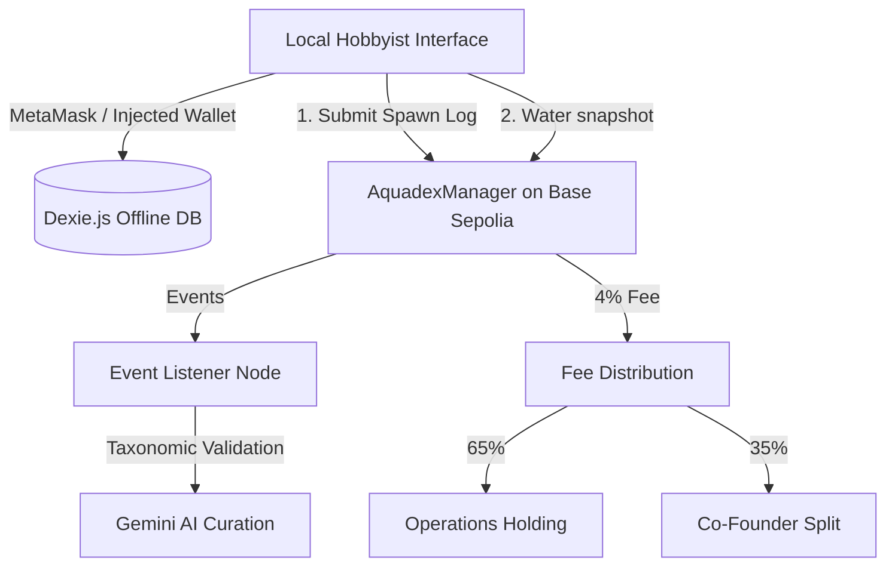

# Aquadex Protocol (Aquacellum) — Project Specification
### Source of Truth for Decentralized Biological Provenance & Distributed Telemetry on Base L2

---

## 1. Executive Summary & Vision

The **Aquadex Protocol** (Aquacellum) is an open-source biological provenance framework designed to map, track, and preserve aquatic biodiversity in captive environments. It combines an immutable blockchain lineage ledger (ERC-721 specimen logs on Base L2) with local-first operational tools for professional breeders and casual hobbyists.

By bridging hobbyist fishkeeping registries with professional breeding standards, Aquadex addresses the data gap in captive-bred genetic diversity and micro-ecosystem water chemistry.

### Core Value Anchors
- **Immutable Provenance**: Un-falsifiable ancestry trees (Sire/Dam indices) tracing specimens across generations, with inbreeding coefficient detection.
- **Account Abstraction & Zero-Gas** (planned): Seamless onboarding via Coinbase Smart Wallet and Paymaster gasless transactions. Currently testnet uses MetaMask/injected wallet.
- **Local-First Architecture**: Dexie.js offline database with TanStack Query caching. All operational data (action logs, grow-out tracking, photos) works without network.
- **Dual-Mode Experience**: Casual Hobbyist mode (friendly, gamified) and Pro Breeder mode (operational, de-gamified) driven by a single toggle.

### Protocol Fee Structure (Current — Testnet)
- **Total fee**: 4% of transaction price (`TOTAL_FEE_BPS = 400`)
- **Split**: 65% to operations holding wallet / 35% split equally among 3 co-founder slots
- **In-event zone**: Reduced to 2% for transactions inside active expo zones
- **Note**: Fee routing addresses are testnet placeholders. Production will route to marine conservation treasury and ecosystem fund.

### Governance & Curation (Current State)
- **Species catalog curation**: Curator-only (`onlyCurator` modifier). Single curator address hardcoded to project director's wallet.
- **Governance contract**: `AquadexGovernance.sol` is deployed and functional (proposal/vote/execute pattern using specimen NFTs as voting tokens) but **not active** for species additions. The curator bypass is the current operational path.
- **Council members**: 3 co-founders hold `COUNCIL_MEMBER_ROLE` on the marketplace contract. No outside members yet.
- **Future**: Community governance voting will be activated once the catalog stabilizes and sufficient specimen NFTs are distributed.

---

## 2. System Architecture



### Infrastructure Components
1. **Frontend Client**: Multi-page Vite React app (`index.html` landing, `app.html` dashboard) with glassmorphic UI.
2. **Base L2 Smart Contracts**: Registry transactions, pedigree state transitions, escrow/shipping, batch checkout.
3. **FishBase Master Catalog**: Offline JSON (`fishbase_master.json`) — 326 species with taxonomic envelopes (temp/pH/volume bounds).
4. **Local Database**: Dexie.js v9 schema with tables: `species`, `listings`, `tanks`, `actionLogs`, `userProfile`, `breederCompanion`, `pendingHandshakes`, `speciesManifest`, `spawnGrowout`.
5. **Serverless API**: Vercel edge function for species suggestion validation (WoRMS + Gemini AI audit).

---

## 3. Smart Contracts

All contracts deployed on **Base Sepolia (Chain ID 84532)**.

| Contract | Address | Purpose |
|----------|---------|---------|
| AquadexManager | `0x351ca8f34D94F29F6f865Afa419A636324473DeF` | Registry, specimens, tanks, spawns, species catalog |
| AquadexMarketplace | `0x16168B514144e0380610b78d904a4de51ba03Ca3` | P2P escrow, shipping, handshakes, batch checkout, expo mode |
| AquadexGovernance | (deployed) | Proposal/vote system (inactive for curation) |
| AquadexStorage | (inherited) | Shared state, enums, structs |

### Key Contract Features
- **Specimen Registry**: ERC-721 tokens with speciesId, sireId, damId, breeder, tankId, IPFS metadata.
- **Spawn Lifecycle**: `SpawnStatus` enum: Egg → Fry → Raised → Failed. On-chain spawn records with offspring arrays.
- **Marketplace Escrow**: Dual-channel (shipping + in-person handshake). Commit-reveal PIN scheme for local pickup.
- **Batch Checkout**: `purchaseMultipleSpecimens()` with MAX_BATCH_CHECKOUT_SIZE = 6 (DoS protection).
- **Expo Mode**: GPS-zone-gated cash handshake bypass with reduced fees and double XP.
- **Shipping Escrow**: 3-day transit safety window, dispute resolution by curator.

---

## 4. Metric Scaling (On-Chain Storage)

| Metric | Scaling | Type | Example |
|--------|---------|------|---------|
| Temperature | ×10 | `int16` | 23.5°C → `235` |
| pH | ×10 | `uint8` | 7.2 → `72` |
| Salinity (SG) | ×10,000 | `uint16` | 1.0240 → `10240` |
| Nitrogen (ppm) | ×100 | `uint16` | 0.25 ppm → `25` |

---

## 5. Frontend Features

### Dual-Mode Interface
- **Casual Hobbyist**: Friendly copy, gamified XP/companion, consumer badges, hidden blockchain details.
- **Pro Breeder**: Operational language, suppressed gamification, full token IDs/hashes, facility hierarchy, PDF exports.

### Core Operational Tools
- **Facility Tree View**: Hierarchical Facility → Room → Rack → Unit tree with nested containment, water-health alerts.
- **Bulk/Rack-Level Logging**: Scope selector (Single Tank / Entire Rack / Entire Room) with saved templates. Off-chain, instant.
- **Spawning Wizard**: 4-step flow (pair selection → telemetry snap → genetic markers → bulk offspring allocation) with inbreeding coefficient detection.
- **Spawn Grow-Out Tracker**: Per-spawn yield funnel (Eggs → Fry → Alive → Sold → Lost/Culled) with survival rate, checkpoint history.
- **Species Catalog**: 326 species with compatibility checking, personality text (dual-mode), care guides.
- **Marketplace**: Active listings, proximity radar map (fuzzed coordinates), consolidated shipping checkout.
- **Handshake Verification**: Commit-reveal PIN + QR code for in-person transactions.

### Export & Portability
- **Data Export/Import**: Full Dexie DB + localStorage photos/metadata in JSON backup (schema v2).
- **Pedigree Certificate PDF**: Landscape, 3-gen ancestry tree, specimen photo, COI badge, verification QR.
- **Facility Summary PDF**: Unit counts, rack breakdown, alerts, recent spawns.
- **Tank QR Labels**: Printable 76×51mm labels with scannable deep-link QR codes.

### Gamification (Casual Mode)
- XP system (Hobbyist XP + Prestige XP), level progression, breeder companion fish (egg → hatched → tiered evolution).
- Regional God-Tier leaderboard, expo double-XP events, expert mentorship social feed.
- All gamification suppressed/quieted in Pro mode (companion hidden, toasts operational, XP bar muted).

---

## 6. Data Structures

### fishbase_master.json (326 species)
```json
{
  "specCode": 2001,
  "scientificName": "Paracheirodon innesi",
  "commonName": "Neon tetra",
  "tankMetrics": { "tempRangeCelsius": [22.0, 28.0], "phRange": [6.5, 7.5], "difficulty": "Intermediate" },
  "personality": {
    "vibeLine": { "casual": "...", "pro": "..." },
    "flavorText": { "casual": "...", "pro": "..." }
  }
}
```

### Dexie.js Schema (v9)
- `species`: specCode, commonName, scientificName, type, difficulty
- `listings`: id, tokenId, seller, price, isBatch, speciesId
- `tanks`: id, ownerAddress, name, active
- `actionLogs`: ++id, tankId, actionType, timestamp, details
- `userProfile`: walletAddress, level, prestigeXp, hobbyistXp, isCouncilMember
- `breederCompanion`: walletAddress, eggState, companionXp, currentTier, selectedStats, zoneHash
- `pendingHandshakes`: purchaseId, pin, salt, buyerAddress
- `speciesManifest`: speciesId, scientificName, commonName, contractAddress, cachedAt
- `spawnGrowout`: ++id, spawnId, timestamp, type

---

## 7. Development & Verification

### Build
```bash
cd frontend && npm run build    # Vite production build
npx hardhat test                # Contract test suites (from root)
```

### Key Dependencies
- React 18, Vite 5, TanStack Query/Virtual, Dexie 4, ethers 5, Fuse.js, jsPDF, qrcode
- Hardhat, OpenZeppelin (AccessControl, ERC721, ReentrancyGuard)

### Deployment
- **Frontend**: Vercel (aquacellum.com)
- **Contracts**: Base Sepolia testnet
- **Species Catalog**: 283/283 seeded on-chain via batch script

---

## 8. Development History

Full dated development logs are maintained in [CHANGELOG.md](./CHANGELOG.md).
