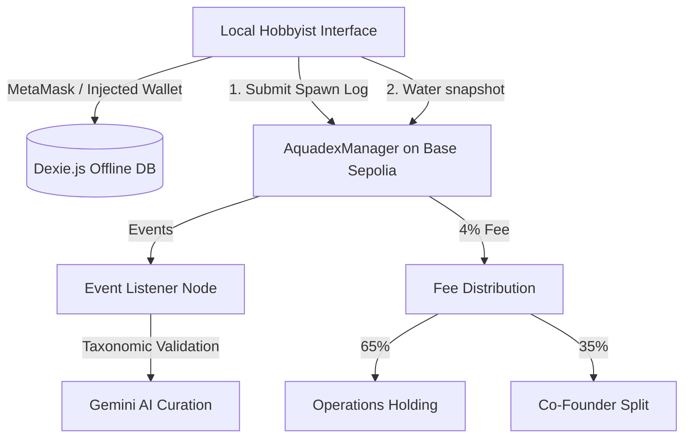

# Aquadex Protocol (Aquacellum) — Project Specification
### Source of Truth for Decentralized Biological Provenance & Distributed Telemetry on Base L2

---

## 1. Executive Summary & Vision

The **Aquadex Protocol** (Aquacellum) is an open-source biological provenance framework designed to map, track, and preserve aquatic biodiversity in captive environments. It combines an immutable blockchain lineage ledger (ERC-721 specimen logs on Base L2) with local-first operational tools for professional breeders and casual hobbyists.

By bridging hobbyist fishkeeping registries with professional breeding standards, Aquadex addresses the data gap in captive-bred genetic diversity and micro-ecosystem water chemistry.

### Core Value Anchors
- **Immutable Provenance**: Un-falsifiable ancestry trees (Sire/Dam indices) tracing specimens across generations, with inbreeding coefficient detection.
- **Account Abstraction & Embedded Wallets**: Seamless onboarding via Privy embedded MPC wallets (email/Google login). EIP-4337 smart wallets (Coinbase Smart Account) for gasless on-chain writes. CDP Paymaster sponsors all gas fees. MetaMask available as fallback for advanced users.
- **Local-First Architecture**: Dexie.js offline database with TanStack Query caching. All operational data (tanks, action logs, grow-out tracking, photos) works without network. On-chain writes batched via EIP-4337 UserOperations in the background (3-second queue, max 10 per batch).
- **Dual-Mode Experience**: Casual Hobbyist mode (friendly, gamified) and Pro Breeder mode (operational, de-gamified) driven by a single toggle.
- **Narrative Onboarding**: Cinematic dual-pane wizard guided by Poseidon (AI assistant) with a living visual stage. Persona selection → Privy-only login → display name confirmation (uniqueness-checked) → Echo egg hatch (real art assets) → guided spotlight tour of real tank/fish registration → profile picture nudge. Per-account completion flag (Supabase + Dexie mirror + localStorage cache) ensures it shows exactly once. Replay available from Settings without data loss.
- **Poseidon AI Intelligence Layer**: **Vertex AI (Gemini 2.5 Flash)** powered freshwater fish expert, grounded via RAG in the curated 326-species catalog. Provides natural language search, spawn thread narration, species compatibility advice, image alt-text generation, and contextual Q&A — all routed through server-side Edge Functions with structured JSON responses. User-controllable via Settings toggle. Runs on Vertex AI billed to the `aquacellum` Cloud project; simple/high-volume endpoints use the cheaper Gemini 2.5 Flash-Lite.
- **Social Layer (The Reef)**: Full social backbone with profiles, Tank Currents feed, reactions, comments, Tankmate connections, Schools (clubs), Expert Audits, mentorship pairing, Tides (live events with GPS maps, auctions, real-time chat), and push notifications via Web Push VAPID.

### Protocol Fee Structure (Current — Testnet)
- **Total fee**: 4% of transaction price (`TOTAL_FEE_BPS = 400`)
- **Split**: 65% to operations holding wallet / 35% split equally among 3 co-founder slots
- **In-event zone**: Reduced to 2% for transactions inside active expo zones
- **Note**: Fee routing addresses are testnet placeholders. Production will route to marine conservation treasury and ecosystem fund.

### Governance & Curation (Current State)
- **Species catalog curation**: Curator-only (`onlyCurator` modifier). Single curator address hardcoded to project director's wallet.
- **Governance contract**: `AquadexGovernance.sol` is deployed and functional (proposal/vote/execute pattern using specimen NFTs as voting tokens) but **not active** for species additions. The curator bypass is the current operational path.
- **Council members**: 3 co-founders hold `COUNCIL_MEMBER_ROLE` on the marketplace contract. No outside members yet.
- **Future**: Community governance voting will be activated once the catalog stabilizes and sufficient specimen NFTs are distributed.

---

## 2. System Architecture


```mermaid
graph TD
    User[Local Hobbyist Interface] -->|MetaMask / Injected Wallet| LocalDB[(Dexie.js Offline DB)]
    User -->|1. Submit Spawn Log| Manager[AquadexManager on Base Sepolia]
    User -->|2. Water snapshot| Manager
    Manager -->|Events| EventListener[Event Listener Node]
    EventListener -->|Taxonomic Validation| GeminiNode[Gemini AI Curation]
    Manager -->|4% Fee| Treasury[Fee Distribution]
    Treasury -->|65%| Ops[Operations Holding]
    Treasury -->|35%| Founders[Co-Founder Split]
```

### Infrastructure Components
1. **Frontend Client**: Multi-page Vite React app (`index.html` landing, `app.html` dashboard, `database.html` species registry, `reef.html` social landing, `reef-xr.html` immersive 3D reef, `hobbyist.html` + `breeder.html` persona pages) with glassmorphic UI.
2. **Immersive Reef (WebXR)**: Three.js/R3F freshwater aquarium experience with boid-based fish schools (316 species as transparent cutout billboards), 6 switchable freshwater biomes (Amazon Blackwater, Dutch Planted, Asian Stream, Rift Lake, Iwagumi, Crystal Spring), real plant cutouts scattered in depth layers, companion guide (Echo as cutout sprite), Poseidon narration, spatial audio, and multiplayer presence. Each biome (and the default Main Reef) renders an Imagen-generated substrate texture (`/biomes/{biome}/floor.png`) and a wraparound underwater backdrop (`backdrop.png`). Fish are floor-clamped so they never clip below the substrate. Three modes: Master Reef (full catalog), My Tank (personal), Visit Tank (social tour). Explorable spread layout with deterministic species placement. 3D model pipeline (TripoSR + baked textures on RTX 5080) preserved behind feature flag; cutout sprites are the active visual pass.
2. **Base L2 Smart Contracts**: Registry transactions, pedigree state transitions, escrow/shipping, batch checkout.
3. **FishBase Master Catalog**: Offline JSON (`fishbase_master.json`) — 316 species with full taxonomic envelopes (verified temp/pH/volume bounds from FishBase v25.04 parquet, Seriously Fish scrape, and manual curation). 100% coverage on tank metrics, ecology, diet, and reproduction for all fish species.
4. **Local Database**: Dexie.js v10 schema with tables: `species`, `listings`, `tanks`, `actionLogs`, `userProfile`, `breederCompanion`, `pendingHandshakes`, `speciesManifest`, `spawnGrowout`, `feedCache`, `socialNotifications`, `draftContent`.
5. **Serverless API**: Vercel serverless functions for species suggestion validation (WoRMS + Gemini AI audit), transaction relayer, and Poseidon AI gateway.
6. **Poseidon AI Gateway**: `/api/poseidon` (Vertex AI, Gemini 2.5 Flash) — structured JSON responses, RAG-grounded in 326-species catalog, multi-turn context, rate-limited (20/hr). Additional endpoints: `/api/parse-search` (NL query parsing, Gemini 2.5 Flash-Lite), `/api/generate-alt-text` (Gemini 2.5 Flash-Lite vision for accessibility), `/api/suggest-species` (WoRMS + Gemini 2.5 Flash audit). All authenticate to Vertex AI via a service account (`_lib/vertexClient.js`), billed to the `aquacellum` Cloud project. Static reef art is generated with Imagen 4 on Vertex (`scripts/imagen_generate.py`).
7. **Social Backend**: Supabase Postgres (19 tables with RLS + notification triggers + cron), Supabase Storage (media CDN), Supabase Realtime (live chat + notifications), 8 Edge Functions (`send-push`, `tide-lifecycle`, `reef-digest`, `breeder-summary`, `content-moderation`, `tide-narration`, `mentor-match`, `anti-gaming`), Web Push via VAPID. Migrations consolidated in `supabase/migrations/` (001–010).
8. **On-Chain Relay (EIP-4337)**: Coinbase Smart Wallet + CDP Paymaster. All on-chain writes (mints, tank registration, water logs, spawns, marketplace listings) are submitted as gas-sponsored UserOperations via the CDP Bundler. Operations are batched client-side (3s debounce, max 10 per UserOp) for gas efficiency. Smart wallet: `0x53d3c6F4F11b0B08bC1A5034bBCe7d46198b6851`.

---

## 3. Smart Contracts

All contracts deployed on **Base Sepolia (Chain ID 84532)**.

| Contract | Address | Purpose |
|----------|---------|---------|
| AquadexManager | `0x351ca8f34D94F29F6f865Afa419A636324473DeF` | Registry, specimens, tanks, spawns, species catalog |
| AquadexMarketplace | `0x16168B514144e0380610b78d904a4de51ba03Ca3` | P2P escrow, shipping, handshakes, batch checkout, expo mode |
| AquadexGovernance | (deployed) | Proposal/vote system (inactive for curation) |
| AquadexStorage | (inherited) | Shared state, enums, structs |

### Key Contract Features
- **Specimen Registry**: ERC-721 tokens with speciesId, sireId, damId, breeder, tankId, IPFS metadata.
- **Spawn Lifecycle**: `SpawnStatus` enum: Egg → Fry → Raised → Failed. On-chain spawn records with offspring arrays.
- **Marketplace Escrow**: Dual-channel (shipping + in-person handshake). Commit-reveal PIN scheme for local pickup.
- **Batch Checkout**: `purchaseMultipleSpecimens()` with MAX_BATCH_CHECKOUT_SIZE = 6 (DoS protection).
- **Expo Mode**: GPS-zone-gated cash handshake bypass with reduced fees and double XP.
- **Shipping Escrow**: 3-day transit safety window, dispute resolution by curator.

---

## 4. Metric Scaling (On-Chain Storage)

| Metric | Scaling | Type | Example |
|--------|---------|------|---------|
| Temperature | ×10 | `int16` | 23.5°C → `235` |
| pH | ×10 | `uint8` | 7.2 → `72` |
| Salinity (SG) | ×10,000 | `uint16` | 1.0240 → `10240` (legacy, not used in UI) |
| Nitrogen (ppm) | ×100 | `uint16` | 0.25 ppm → `25` |

---

## 5. Frontend Features

### Dual-Mode Interface
- **Casual Hobbyist**: Friendly copy, gamified XP/companion, consumer badges, hidden blockchain details.
- **Pro Breeder**: Operational language, suppressed gamification, full token IDs/hashes, facility hierarchy, PDF exports.

### Core Operational Tools
- **Facility Tree View**: Hierarchical Facility → Room → Rack → Unit tree with nested containment, water-health alerts.
- **Bulk/Rack-Level Logging**: Scope selector (Single Tank / Entire Rack / Entire Room) with saved templates. Off-chain, instant.
- **Spawning Wizard**: 4-step flow (pair selection → telemetry snap → genetic markers → bulk offspring allocation) with inbreeding coefficient detection.
- **Spawning Dashboard**: Certificates list (all registered birth certificates with lineage), Hatchery Insights (stats: total spawns, avg clutch size, species breakdown, 30-day trends), and Spawning Logs (chronological event feed with status tracking).
- **Spawn Grow-Out Tracker**: Per-spawn yield funnel (Eggs → Fry → Alive → Sold → Lost/Culled) with survival rate, checkpoint history.
- **Species Catalog**: 326 species with compatibility checking, personality text (dual-mode), care guides.
- **Marketplace**: Active listings, proximity radar map (fuzzed coordinates), consolidated shipping checkout.
- **Handshake Verification**: Commit-reveal PIN + QR code for in-person transactions.

### Export & Portability
- **Data Export/Import**: Full Dexie DB + localStorage photos/metadata in JSON backup (schema v2).
- **Pedigree Certificate PDF**: Landscape, 3-gen ancestry tree, specimen photo, COI badge, verification QR.
- **Facility Summary PDF**: Unit counts, rack breakdown, alerts, recent spawns.
- **Tank QR Labels**: Printable 76×51mm labels with scannable deep-link QR codes.

### Founders Dashboard (Internal)
- **Wallet-Gated Access**: Only allowlisted founder wallets see the "📊 Founders" tab. Non-founders have zero visibility.
- **KPI Strip**: Total Users, DAU, Specimens Minted, Protocol Fees, Marketplace GMV, Live Activity.
- **Charts**: User Growth (area chart, 7/30/90d), Protocol Activity (bar chart — specimens/spawns/userOps per week).
- **Social & AI Panels**: Reef engagement metrics, Poseidon query breakdown (donut chart by intent).
- **Operational Health**: Live service status checks (Poseidon AI, Supabase, Mux, Stripe, Smart Contracts).
- **Auto-Refresh**: 60-second polling interval. Manual refresh button available.
- **Data Sources**: Supabase aggregate queries with graceful fallback to mock data when tables don't exist yet.

### Gamification (Casual Mode)
- Unified XP system (single `totalXp` pool) with mode-aware labels ("Loyalty Points" for casual, "Reputation XP" for pro).
- 5-tier canonical progression: Shallow (0–1,499) → Coastal (1,500–2,499) → Pelagic (2,500–4,999) → Abyssal (5,000–9,999) → Hadal (10,000+).
- Breeder companion fish (egg → hatched → tiered evolution), tier derived from totalXp.
- Regional God-Tier zone leaderboard (adaptive zones), expo double-XP events, expert mentorship social feed.
- Anti-gaming cooldowns per action per tank. Monthly Loyalty Rewards Pool distribution (40% of protocol fees).
- All gamification suppressed/quieted in Pro mode (companion hidden, toasts operational, XP bar in collapsible panel).

### Echo AI Companion (Casual Mode)
- **Dashboard Widget**: Persistent sidebar card showing Echo's avatar (tier art with glow), mood indicator, poetic one-liner, care streak badge, progress bar to next tier. Tap-to-expand shows recent reactions.
- **Mood State Machine**: 6 moods (joyful/pleased/calm/curious/concerned/quiet) determined by streak, activity, time since last action. ~36 poetic lines rotate per mood.
- **Whisper Nudges**: Floating speech bubble (bottom-left) with contextual micro-prompts — care reminders, progress nudges, streak encouragement. Priority-ranked, 2min cooldown, auto-dismiss after 8s.
- **AI Observations**: Poseidon-backed (Gemini) per-session observation on tank open — warm, species-specific, max 25 words. Cached in sessionStorage, falls back to canned lines when offline.
- **Action Reactions**: Immediate poetic feedback after care actions ("Fed and happy. Echo approves."). 7 action types with multiple variants.
- **Pre-hatch State**: Egg with progress bar for new users (< 500 pts). Evolves visually through tiers.

### Social Layer — "The Reef" (MVP Live)
- **Tank Currents**: Users post updates with photos, text, linked tank, water parameters snapshot, and species tags.
- **Social Feed**: Two modes — "My Feed" (chronological from Tankmates + watched tanks) and "Explore" (all public posts).
- **Reactions**: Six emoji reactions (🔥 🐟 💧 🌿 👏 ⭐) with optimistic UI and toggle behavior.
- **Threaded Comments**: 1-level threaded comment system on any Current.
- **Tankmate Connections**: Mutual connection requests with optional message, accept/decline flow.
- **Watch Tank**: One-way subscription to specific tanks for feed updates (no approval needed).
- **Public Profiles**: Wallet-linked profile with display name, avatar, bio, stats (XP, tanks, species, companion tier), and Tankmates list.
- **Sonar Notifications**: Auto-dispatched via Postgres triggers on reactions, comments, and Tankmate requests. Real-time delivery via Supabase Realtime.
- **Photo Uploads**: Client-side resize (max 2048px) → Supabase Storage (CDN-delivered).
- **Dual-Mode Labels**: "The Reef" / "Tankmates" / "Currents" in casual mode → "Social Feed" / "Connections" / "Posts" in pro mode.
- **Species Insights**: Micro-content system (280-char tips) on species pages. 5 categories (Care Tip, Warning, Breeding, Compatibility, Behavior). Upvotable/downvotable. Integrated as tab in species detail view.
- **Badge Shelf**: 25 auto-awarded achievement badges on profiles. Categories: Collection (6), Tier (5), Community (4), XP Milestones (4), Event (4 — Expo Attendee, Challenge Victor, 30/90-day Streak), Weekly Contributor (1, refreshes Monday). Calculated from stats: tank count, species, companion tier, XP, posts, insights, tankmates, streaks, expo transactions, challenge wins, zone champion status.
- **Profile Edit**: Inline editor on own profile — change name, bio (280 chars), upload avatar photo anytime.
- **Share from Tanks**: "Share on The Reef" button in tank detail social tab — navigates to Reef and opens composer pre-filled with that tank.
- **Backend**: Supabase Postgres (15+ tables, RLS, notification triggers, 2 Edge Functions) + Supabase Storage + Supabase Realtime + Web Push (VAPID).
- **Schools (Phase 2)**: Clubs with directory, real-time persistent chat, challenges, role-based management.
- **Tides (Phase 3)**: Live events — Expo (GPS-gated), Virtual (stream), Challenge, Auction. Calendar, RSVP, swap sheet, real-time chat, Mapbox map, auction bidding. Lifecycle cron via Edge Function.
- **Expert Audits (Phase 2)**: Scorecard reviews (4 categories), request flow, XP distribution.
- **Mentorship (Phase 2)**: Master+ pairing with 1.5× XP multiplier.
- **Web Push (Phase 3)**: VAPID-authenticated push notifications, per-category preferences, quiet hours.
- **Depth Score (Phase 4)**: Full reputation system — Shallow→Hadal tiers, auto-calculated from audits/insights/spawns/moderation. Tier-gated privileges. Anti-gaming detection (mutual upvote rings, score spikes, zero-engagement accounts).
- **Poseidon Social AI (Phase 4)**: Weekly Reef Digest, Breeder Summary auto-generation, Tide live narration + post-event recaps, AI content moderation (text + image via Gemini), Poseidon mentor matching.
- **Edge Functions (10 deployed)**: `send-push`, `tide-lifecycle`, `reef-digest`, `breeder-summary`, `content-moderation`, `tide-narration`, `mentor-match`, `anti-gaming`, `validate-xp-event`, `distribute-rewards`.
- **Search (Phase 5)**: Supabase full-text search across profiles, currents, schools, tides, and insights. Global search bar with keyboard shortcut (/), grouped results dropdown, mobile-responsive. Poseidon NL search for species via Gemini.
- **Discovery (Phase 1)**: Three sub-features in the Discover tab — Nearby Breeders (zoneHash regional grouping), Breeders Who Keep [Species] (species-tag search), and Top Contributors This Week (materialized view weekly_contributors with XP totals + action counts, fallback to manual Insights + Audits query).
- **Zone Leaderboard (Phase 2)**: Adaptive-density regional zones (27 metro regions + sparse fallback). Materialized view zone_leaderboard. Dashboard sidebar widget with top 5, cross-zone browsing picker, zone champion callout. Zone assignment flow with 90-day transfer cooldown.
- **Loyalty Rewards Pool (Phase 3)**: 40% of 4% protocol fee accumulates in pool. Monthly distribution proportional to XP earned (eligibility: 500+ total XP + marketplace activity in 90d). Credits expire 12 months after award. Tier-based passive discount at checkout (Coastal 2% → Hadal 8%). RewardCreditsCard dashboard widget. Edge Function cron for monthly distribution + notifications.
- **Rate Limiting (Phase 5)**: Client-side throttle (localStorage) — 10 posts/hr, 50 comments/hr, 100 reactions/hr, 3 audits/day, 1 school/day, 20 Poseidon/hr. Wired into all social API mutations.
- **Moderation (Phase 5)**: Admin panel for Hadal-tier curators — flagged content queue with dismiss/hide/warn/mute/ban actions, Poseidon AI case summaries, escalation history.
- **GDPR (Phase 5)**: Data export (parallel fetch across 9 tables → JSON download) and account deletion (soft-delete with 30-day grace, cancellation, countdown). Integrated into profile settings.
- **Performance (Phase 5)**: Reef social layer code-split via React.lazy + Suspense (~157 kB off main bundle).
- **Accessibility (Phase 5)**: Focus trap, screen reader announcements, keyboard helpers, WCAG AA contrast checker, reduced-motion detection. ARIA attributes on all interactive social components.
- **Integration Tests (Phase 5)**: 17-test suite covering rate limiter, profile CRUD, content lifecycle, social connections, GDPR export, notifications. Vitest runner.
- **Planned (Phase 5)**: Virtual Tide streaming (built, coming-soon gated), Poseidon auto-transcription (deferred until livestream live).

### Landing Pages
- **Main** (`index.html`): Platform overview, dual-mode explainer, Spec-Dex preview, marketplace, Poseidon & Echo companion.
- **Database** (`database.html`): Species registry with search, filter, and flip-card grid (326 species).
- **The Reef** (`reef.html`): Social layer landing — coral/ocean-blue palette, mock feed UI, Depth Score tier ladder, Schools showcase, Tides with expanded expo map + auction/leaderboard previews.
- **For Hobbyists** (`hobbyist.html`): Casual-mode pitch, sky-blue palette.
- **For Breeders** (`breeder.html`): Pro-mode pitch, neon-purple palette.
- **About** (`about.html`): Mission, team (GGSteve92 & McDermKev81), values, contact.
- **Legal** (`legal.html`): Terms of Service, Privacy & Data Collection Policy, Beta Program Terms, Community Guidelines — all in one page with anchor navigation.

---

## 6. Data Structures

### fishbase_master.json (326 species)
```json
{
  "specCode": 2001,
  "scientificName": "Paracheirodon innesi",
  "commonName": "Neon tetra",
  "tankMetrics": { "tempRangeCelsius": [22.0, 28.0], "phRange": [6.5, 7.5], "difficulty": "Intermediate" },
  "personality": {
    "vibeLine": { "casual": "...", "pro": "..." },
    "flavorText": { "casual": "...", "pro": "..." }
  }
}
```

### Dexie.js Schema (v11)
- `species`: specCode, commonName, scientificName, type, difficulty
- `listings`: id, tokenId, seller, price, isBatch, speciesId
- `tanks`: id, ownerAddress, name, active
- `actionLogs`: ++id, tankId, actionType, timestamp, details
- `userProfile`: walletAddress, totalXp, currentTier, zoneHash, isCouncilMember, onboardingComplete
- `breederCompanion`: walletAddress, eggState, currentTier, selectedStats, zoneHash
- `pendingHandshakes`: purchaseId, pin, salt, buyerAddress
- `speciesManifest`: speciesId, scientificName, commonName, contractAddress, cachedAt
- `spawnGrowout`: ++id, spawnId, timestamp, type
- `feedCache`: ++id, contentId, authorWallet, createdAt, [authorWallet+createdAt]
- `socialNotifications`: ++id, category, isRead, createdAt
- `draftContent`: ++id, type, status, createdAt
- `xpCooldowns`: ++id, walletAddress, actionType, tankId, timestamp, [walletAddress+actionType+tankId]

### Supabase Schema (Social Layer)
- `profiles`: wallet_address (PK), display_name, avatar_url, bio, privacy_settings, tank_count, species_count, xp_total, total_xp, current_tier, zone_hash, monthly_xp, reward_credits, streak_days, last_active_date, companion_tier, notification_preferences, onboarding_complete
- `zones`: zone_hash (PK), display_name, center_lat, center_lng, radius_miles, population_tier, member_count, champion_wallet
- `xp_events`: id, wallet_address, action_type, points_awarded, multiplier, final_points, zone_hash, metadata, created_at
- `reward_pool_ledger`: id, source_type, source_id, gross_fee, pool_contribution, seller_wallet, buyer_wallet, created_at
- `reward_distributions`: id, wallet_address, distribution_period, monthly_xp_earned, total_pool_xp, pool_balance, user_share_pct, credits_awarded
- `credit_transactions`: id, wallet_address, amount, transaction_type, reference_id, description, expires_at
- `zone_leaderboard` (materialized view): wallet_address, display_name, avatar_url, total_xp, current_tier, zone_hash, zone_name, zone_rank, is_champion
- `weekly_contributors` (materialized view): wallet_address, display_name, avatar_url, current_tier, weekly_xp, action_count, weekly_rank
- `currents`: id, author_wallet, title, body, media_urls, linked_tank_id, linked_tank_name, species_tags, parameters_snapshot, visibility
- `reactions`: id, user_wallet, target_id, emoji (UNIQUE per user/target/emoji)
- `comments`: id, author_wallet, current_id, parent_comment_id, body
- `follows`: id, follower_wallet, follow_type, target_wallet, target_tank_id, is_mutual
- `connection_requests`: id, from_wallet, to_wallet, message, status
- `sonar_notifications`: id, recipient_wallet, category, title, body, icon, link_type, link_id, is_read
- `species_insights`: id, author_wallet, spec_code, category, body (280 chars), upvotes, downvotes
- `schools`: id, name, slug, school_type, founder_wallet, tracked_species, member_count
- `school_members`: id, school_id, wallet_address, role
- `school_challenges`: id, school_id, title, challenge_type, status, leaderboard
- `school_chat`: id, school_id, author_wallet, body
- `expert_audits`: id, auditor_wallet, recipient_wallet, scores (4 categories), commentary
- `mentorships`: id, mentor_wallet, mentee_wallet, status
- `tides`: id, title, tide_type, host_wallet, start_time, end_time, gps_bounds, status, recap_content
- `tide_attendees`: id, tide_id, wallet_address, rsvp_status, bringing_species, checked_in_at
- `tide_chat`: id, tide_id, author_wallet, body, is_system_message (ephemeral — purged 48h post-event)
- `auction_bids`: id, tide_id, token_id, bidder_wallet, amount_wei, status
- `push_subscriptions`: id, wallet_address, subscription (JSONB), user_agent

---

## 7. Development & Verification

### Build
```bash
cd frontend && npm run build    # Vite production build
npx hardhat test                # Contract test suites (from root)
```

### Key Dependencies
- React 18, Vite 5, TanStack Query/Virtual, Dexie 4, ethers 5, Fuse.js, jsPDF, qrcode, Recharts
- Supabase JS (social layer, storage, realtime)
- google-auth-library (Vertex AI service-account auth for the Poseidon/AI endpoints)
- Hardhat, OpenZeppelin (AccessControl, ERC721, ReentrancyGuard)
- Python: google-genai, pillow, rembg (Imagen asset generation + cutouts); TripoSR/PyTorch (local 3D model pipeline)

### Deployment
- **Frontend**: Vercel (aquacellum.com)
- **Contracts**: Base Sepolia testnet
- **Social Backend**: Supabase (yahsdztnvsykzecjatsl.supabase.co)
- **Media Storage**: Supabase Storage (reef-media bucket, public CDN)
- **Species Catalog**: 283/283 seeded on-chain via batch script

### Project Structure (Root)
```
├── contracts/          # Solidity smart contracts (Hardhat)
├── docs/               # All project documentation (consolidated)
├── frontend/           # Vite React app + Vercel serverless API
│   ├── api/            # Serverless functions (Poseidon, relayer, suggest)
│   ├── public/         # Static assets, species images, fishbase_master.json
│   └── src/            # React source (components/, hooks/, services/, utils/)
├── scripts/            # Hardhat deploy/seed scripts + utilities
├── supabase/           # Canonical Supabase config
│   ├── functions/      # 8 Edge Functions (TypeScript)
│   └── migrations/     # SQL migrations 001–010 (single source of truth)
├── test/               # Contract test suites
├── hardhat.config.js
├── PROJECT_SUMMARY.md  # This file (canonical spec)
├── CHANGELOG.md        # Full development history
└── README.md           # Quick-start guide
```

---

## 8. Development History

Full dated development logs are maintained in [CHANGELOG.md](./CHANGELOG.md).
