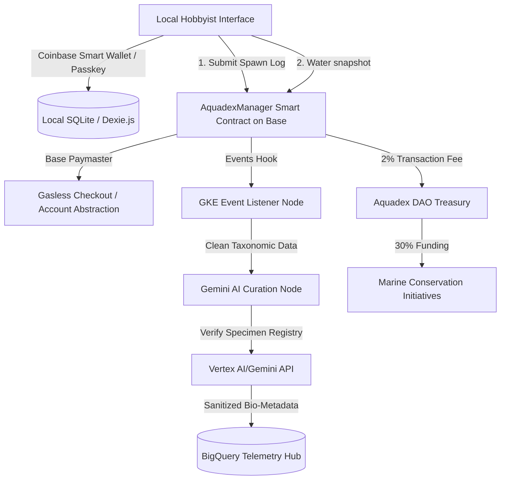

# Grant Proposal: The Aquadex Protocol
**Decentralized Biological Provenance, Distributed Telemetry, and AI-Driven Aquatic Preservation on Base L2**

*Prepared for: Base Batches Cohort & Base Ecosystem Fund (Coinbase Ventures)*  
*Status: Production-Ready Architectural & Grant Specification*

---

## 1. Executive Summary

The **Aquadex Protocol** is an open-source biological provenance framework designed to map, track, and preserve aquatic biodiversity through an un-falsifiable lineage ledger and distributed environmental telemetry. By combining immutable blockchain records (ERC-721 based specimen logs on Base L2) with **Gemini AI curation nodes**, Aquadex cleanses real-time ecological taxonomy data, reconciling localized hobbyist husbandry logging with global scientific standards.

Aquadex addresses a critical gap in ecological research: the absence of verified, decentralized datasets tracking captive-bred genetic diversity and micro-ecosystem chemistry. Through its local-first architecture and Coinbase Smart Wallet integration, Aquadex transforms hobbyist aquariums into distributed environmental monitoring stations. Furthermore, the protocol implements a native economic model wherein a **2% directory fee** fuels a **DAO Treasury**, directing **30% of all protocol proceeds** to real-world marine conservation initiatives.

Under the **Base Batches** program and the **Base Ecosystem Fund**, Aquadex will utilize Base L2's ultra-low transaction costs, Paymaster gas sponsorship, and Coinbase Smart Wallet to bring hundreds of thousands of amateur aquaculture breeders onchain, creating a global decentralized ecological intelligence network.

---

## 2. System Architecture & Base L2 Integration

Aquadex implements a hybrid architecture combining Base L2's high-throughput, low-cost execution with decentralized AI-assisted verification.



### Base L2 Ecosystem Advantage & Integration Map
1. **Coinbase Smart Wallet & Paymasters**: Allows users to interact with Aquadex without needing to buy ETH or manage private keys. By leveraging ERC-4337 Account Abstraction and Paymasters on Base, breeders can log spawns and parameters with zero-gas, passkey-secured accounts.
2. **Sub-Cent Transactions**: Logging daily aquarium parameters requires extremely low fees. Base's OP Stack architecture guarantees that daily logs remain cost-effective (averaging <$0.001 per transaction).
3. **Ecosystem & Coinbase Verifications**: Leveraging Coinbase Verifications (Attestations) to verify the credentials of commercial breeders, commercial hatcheries, and research institutes, ensuring trusted provenance across the supply chain.
4. **Decentralized Telemetry Analytics (BigQuery Integration)**: Real-time onchain telemetry events from Base are indexed and routed directly into BigQuery for public scientific research.

---

## 3. Core Framework & AI Taxonomy Scrubbing

### Gemini AI Curation Nodes
Hobbyist data is notoriously messy. A common issue in ecological crowd-sourcing is taxonomic naming drift, misspelling, and localized vernacular (common names) that do not align with verified indices such as the *World Register of Marine Species (WoRMS)* or *NCBI Taxonomy*.

Aquadex deploys **Gemini AI Nodes** to serve as the gateway curation layer:
* **Contextual Parsing**: Gemini parses raw text input (e.g., *"neon tetra with slight tail variation logged as sire"*) and maps it to the precise taxonomic structure:
  * **Order**: *Characiformes*
  * **Family**: *Characidae*
  * **Genus**: *Paracheirodon*
  * **Species**: *Paracheirodon innesi*
* **Pedigree Verification**: The AI verifies parent-child lineage claims. For example, it detects biological impossibilities (e.g., matching parents of different species or incompatible geographic origins) and flags them before on-chain validation is finalized.
* **Semantic Standardization**: Resolves vernacular gaps instantly. If an aquarist inputs *"Clown anemonefish"*, Gemini aligns it with the canonical catalog entry *Amphiprion ocellaris*.

---

## 4. Local-First Telemetry & Distributed Climate Resilience

Aquadex adopts a **local-first data design** to ensure maximum offline availability and low-cost execution. Hobbyists can track chemistry metrics without active internet connections, syncing their localized ledgers with the main blockchain when online.

### Environmental Telemetry Schema
Every aquarium system logs periodic snapshots consisting of critical water parameters:
* **pH Levels** (scaled by 10 to fit unsigned integers, e.g., `82` for `8.2`)
* **Temperature** (Celsius scaled by 10, e.g., `254` for `25.4°C`)
* **Salinity** (Specific Gravity scaled by 10,000, e.g., `10240` for `1.0240`)
* **Nitrogen Compounds** (Ammonia, Nitrite, Nitrate scaled by 100 for parts-per-million tracking)

These localized data points aggregate into a global, distributed dataset. As climate change alters coastal salinity levels, ocean temperatures, and run-off nitrate concentrations, the Aquadex telemetry ledger provides a controlled control-group baseline of closed-loop aquatic environments across the globe. This data is structured and exported to public researchers via BigQuery datasets.

---

## 5. Treasury Tokenomics & Marine Conservation Routing

To fund real-world biological preservation, the protocol enforces an automated, code-governed fee allocation model inside the [AquadexMarketplace.sol](file:///c:/Users/mcder/Desktop/fish-dex-protocol/contracts/AquadexMarketplace.sol) contract.

| Parameter | Value | Target Allocation |
| :--- | :--- | :--- |
| **Directory P2P Exchange Fee** | 2% | Auto-escrowed from transactions |
| **Marine Conservation DAO Routing** | 30% of fees | Directly sent to Marine Preservation Initiatives |
| **Developer & Node Operations** | 40% of fees | Allocated for GKE hosting & Vertex AI execution costs |
| **Liquidity & Governance Pool** | 30% of fees | Held in DAO Treasury for community proposals |

### Marine Conservation DAO Allocation (30%)
Funds routed to the Marine Conservation pool are locked inside a multi-signature escrow controlled by the Aquadex Governance contract. This capital is deployed directly to:
1. **Coral Reef Restoration**: Financing offshore coral nurseries utilizing micro-fragmentation methodologies.
2. **Sustainable Aquaculture Research**: Awarding grants to researchers developing open-source feeds to replace fishmeal dependencies.
3. **Taxonomic Ledger Integration**: Upkeeping public database APIs to ensure the Aquadex catalog remains in sync with the global academic community.

---

## 6. Base Builder Journey & Milestones

Aquadex is structured to progress through the Coinbase and Base growth pipeline:

```
[01 Idea: Base Batches] ──> [02 Pre-seed & Seed: Ecosystem Fund] ──> [03 Growth: Coinbase Ventures]
                                                                                │
[06 Listing: Coinbase] <── [05 Public Token Sale: Sonar by Echo] <── [04 Private Fundraise: Echo]
```

1. **Step 01 - Idea: Base Batches (Q3 2026)**
   - Secure early incubator support, deploy core registry contracts to **Base Sepolia testnet**.
   - Build MVP interface featuring Coinbase Smart Wallet connection and Paymaster integration for gasless husbandry logging.
2. **Step 02 - Pre-seed & Seed: Base Ecosystem Fund (Q4 2026)**
   - Launch mainnet beta on Base L2. Open registration for commercial hatcheries using Coinbase Verifications.
   - Establish live event synchronization indexing on-chain transactions directly to BigQuery databases.
3. **Step 03 - Growth: Coinbase Ventures (Q1 2027)**
   - Expand protocol integrations to scale global aquaculture supply chains.
   - Deploy multi-signature DAO governance escrows to automate decentralized ecosystem grants.
4. **Step 04 - Private Fundraise: Echo (Q2 2027)**
   - Leverage the **Echo** platform to conduct a private fundraise targeting strategic onchain investors.
   - Secure capital to expand local-first telemetry hardware integrations and expand core developer tooling.
5. **Step 05 - Public Token Sale: Sonar by Echo (Q3 2027)**
   - Launch the public token sale via **Sonar by Echo** to distribute governance to the broader community of aquaculture hobbyists, ecological researchers, and marine conservationists.
   - Boot up decentralized catalog management governed by utility token voting.
6. **Step 06 - Listing: Coinbase (Q4 2027)**
   - Achieve listing on **Coinbase** to provide deep liquidity for the global marketplace and scientific telemetry network.
   - Transition fully to a decentralized autonomous organization (DAO) managing international conservation initiatives.
