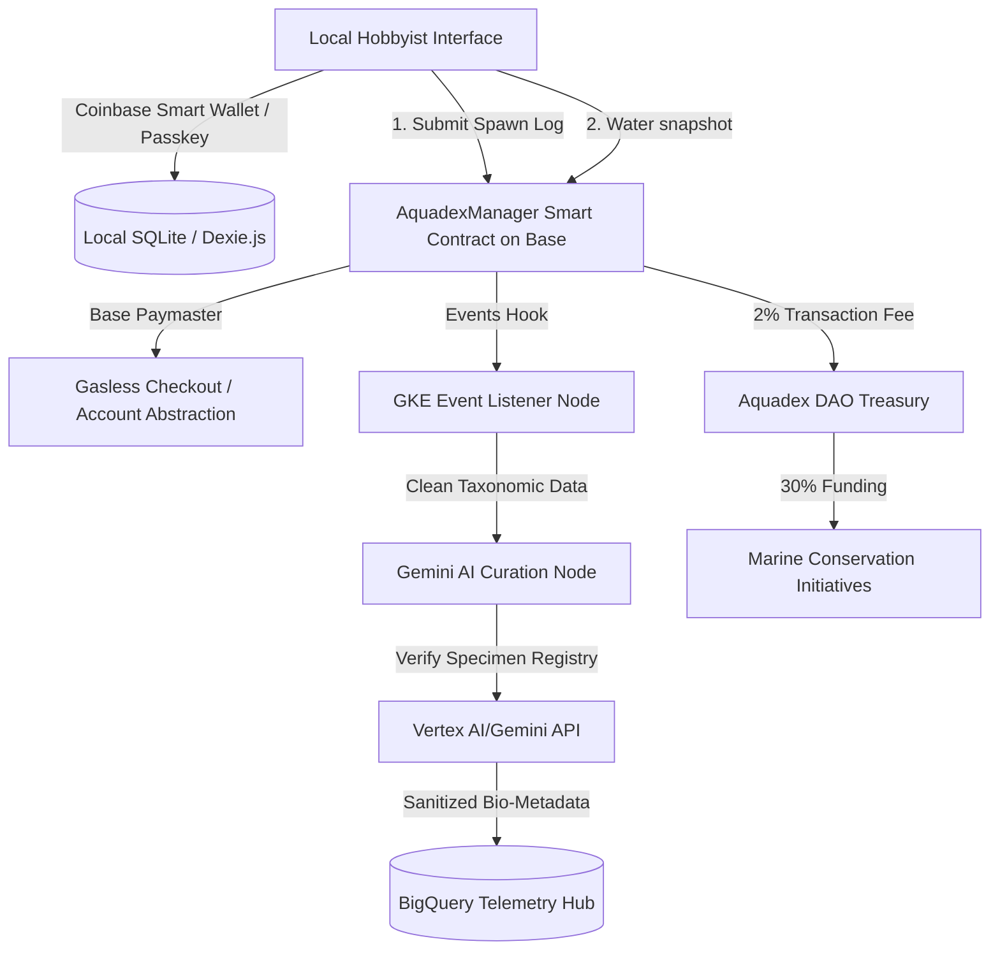

# Aquadex Protocol (Aquacellum)

Welcome to the **Aquadex Protocol**! Aquadex is a decentralized biological provenance and telemetry system designed to safeguard global aquatic biodiversity. By bridging the gap between local aquarium hobbyists and commercial breeding networks, Aquadex records lineage details, tracks water chemistry profiles, and provides trust-ensured peer-to-peer exchanges. Through these tools, everyday aquariums act as a distributed ecological network to monitor environmental health.

---

## 🟢 Live Testnet Deployment — Base Sepolia

| | |
|---|---|
| **Network** | Base Sepolia (Chain ID 84532) |
| **Frontend** | [aquacellum.com](https://aquacellum.com) |
| **AquadexManager** | [`0x351ca8f34D94F29F6f865Afa419A636324473DeF`](https://sepolia.basescan.org/address/0x351ca8f34D94F29F6f865Afa419A636324473DeF) |
| **AquadexMarketplace** | [`0x16168B514144e0380610b78d904a4de51ba03Ca3`](https://sepolia.basescan.org/address/0x16168B514144e0380610b78d904a4de51ba03Ca3) |
| **Species Catalog** | 283 species on-chain |
| **Curator** | `0xc42eD9F8Fc56F89380a8eD337169899f425Dc934` |

**Get testnet ETH**: [Coinbase Faucet](https://www.coinbase.com/faucet) → select Base Sepolia

---

## Who This Is For
- **Commercial Breeder Facilities**: Professional hatcheries and breeders looking to certify lineage, trace bloodlines across multiple generations, manage bulk expo sales safely with geographic privacy, and verify logistics using secure local exchange handshakes.
- **Casual Home Aquarists**: Aquarium hobbyists who want a simple, engaging logbook to track their tank parameters, check species compatibility automatically, and participate in community mentorship networks while nurturing a virtual Breeder Companion.

---

## 1. Technical Architecture Overview

Aquadex is built with a local-first web architecture that coordinates decentralized blockchain storage, telemetry data pipelines, and a React-based frontend client.



### Infrastructure Components
- **Frontend Client**: Multi-page Vite React application utilizing a premium glassmorphic UI system.
- **Base L2 Smart Contracts**: Execute registry transactions, pedigree state transitions, and escrow/shipping handling.
- **FishBase Master Curation File**: Offline JSON manifest (`fishbase_master.json`) storing taxonomic envelopes (temperature/pH/volume bounds) for compatibility evaluations.
- **Local Database & Cache**: Maintains state persistence via `localStorage` and `Dexie.js` for responsive offline capabilities.
- **Social Layer (The Reef)**: Supabase-backed social network with profiles, feed, reactions, comments, Schools (clubs), Expert Audits, mentorship, and real-time chat.
- **Beta Infrastructure**: Local-first tank storage (Dexie.js), server-side transaction relayer for gasless on-chain writes, Privy embedded wallets for frictionless onboarding.

---

## 2. On-Chain Metric Scaling System

To optimize on-chain storage and eliminate floating-point arithmetic overhead in Solidity, the protocol enforces strict metric scaling and validation rules. 

Solidity and the EVM do not natively support floating-point numbers. Representing values like a pH of `7.35` or a temperature of `24.5°C` directly in smart contracts would require either rounding to integers (losing vital precision) or implementing complex, gas-heavy fixed-point math libraries. To circumvent this, the Aquadex Protocol uses a deterministic metric scaling system, multiplying environmental values by powers of 10 to store them as standard integers (`uint` or `int`).

We use simple integer scaling so environmental data can live cleanly and efficiently on-chain without floating-point math.

### Operational Scaling Logic
- **Temperature Ranges**: Stored as $10\times$ scaled signed 16-bit integers (`int16`).
  - *Mathematical Logic*: $T_{\text{on-chain}} = \text{round}(T_{\text{actual}} \times 10)$
  - *Example*: $23.5\text{ °C}$ is recorded on-chain as `235`.
  - *Data Type Choice*: `int16` allows for sub-zero temperatures (for outdoor aquaculture ponds in winter climates) while remaining compact enough to pack multiple values into a single storage slot.
- **pH Ranges**: Stored as $10\times$ scaled unsigned 8-bit integers (`uint8`).
  - *Mathematical Logic*: $\text{pH}_{\text{on-chain}} = \text{round}(\text{pH}_{\text{actual}} \times 10)$
  - *Example*: pH $7.2$ is recorded on-chain as `72`.
  - *Data Type Choice*: `uint8` is ideal since pH values are always non-negative and range from 0 to 14. A scaled value up to 140 fits comfortably in a single byte (max 255).
- **Salinity (Specific Gravity)**: Stored as $10,000\times$ scaled unsigned 16-bit integers (`uint16`).
  - *Mathematical Logic*: $\text{SG}_{\text{on-chain}} = \text{round}(\text{SG}_{\text{actual}} \times 10,000)$
  - *Example*: Specific Gravity of $1.0240$ is recorded on-chain as `10240`.
  - *Data Type Choice*: Specific gravity requires 4 decimal places of precision to detect subtle salinity shifts in reef systems. `uint16` (max 65,535) easily accommodates the scaled values (typically around 10,000).
- **Nitrogen Compounds (Ammonia, Nitrite, Nitrate)**: Stored as $100\times$ scaled unsigned integers (`uint8` or `uint16`) for precision parts-per-million (`ppm`) tracking.
  - *Mathematical Logic*: $\text{ppm}_{\text{on-chain}} = \text{round}(\text{ppm}_{\text{actual}} \times 100)$
  - *Example*: $0.25\text{ ppm}$ ammonia is recorded on-chain as `25`.
  - *Data Type Choice*: Allows precise measurement down to $0.01\text{ ppm}$ intervals, critical for detecting biofilter failures.

---

## 3. Interface Lifecycles: Casual Logbook vs. Breeder Terminal

Aquadex features a dual-persona interface design that dynamically shapes the user experience based on their technical background and operational needs.

### Casual Hobbyist Logbook
Designed for home aquarists and amateur hobbyists who want a simple, game-like experience to track their fish, verify compatibility, and buy specimens locally without feeling overwhelmed by blockchain terminology.

#### Lifecycle & Features:
1. **Onboarding & Access**:
   - Access is initiated via the **"Open My Aquarium Logbook"** panel, displaying reassuring, friendly copy rather than wallets and keys.
   - Profile metrics are presented in a gamified tier: `[ 🐠 Hobbyist Status: Level 4 Aquarist 🌟 ]`.
2. **Setup and Compatibility**:
   - Users use the **Display Tank Setup Wizard** to input their tank size, tap pH, and temperature.
   - When browsing the marketplace, the system automatically checks the compatibility of listings against the configured tank state.
   - If compatible, a glowing green `[100% Compatibility Match]` badge is rendered. Technical data (sire/dam, raw token IDs) is hidden, replacing them with friendly consumer badges (`[ Tank-Bred Premium Stock ]`, `[ Beginner Friendly ]`).
3. **Husbandry & XP Collection**:
   - Everyday tasks (e.g., logging a water snapshot, feeding) award Hobbyist XP, visualized on a warm progress meter.
   - If offline, state changes are cached transparently using `Dexie.js` database tables and synchronized automatically upon reconnect.
4. **Frictionless Purchases**:
   - The user selects specimens, and the system groups listings from the same breeder into consolidated shipping boxes (up to 3 specimens per box).
   - An invoice displays the subtotal, shipping box optimization savings, and the Net Secure Payment, with clear descriptions of how the escrow system protects the order.

---

### Professional Breeder Terminal
Tailored for commercial hatcheries, scientific curators, and veteran breeders who require high-performance logistics tools, detailed genetic lineage tracking, and strict in-person transaction settlements.

#### Lifecycle & Features:
1. **Initialize Breeder Terminal**:
   - Accessed by clicking **"Initialize Breeder Terminal"**, presenting institutional ops framing.
   - Profile cards display the operator node ID: `[ 🧬 Operator Designation: Node 104-Bronx ]`.
2. **Advanced Pedigree Operations**:
   - Breeders view full cryptographic hashes, exact token indices, and recursive ancestry tree diagrams to trace Sire/Dam lineage across generations.
   - Real-time catalog proposals are managed via the **Curation Dashboard**. Authorized curators review suggestions and publish new species directly to the secure central registry.
3. **Secure Transaction Handshakes**:
   - Local pickups utilize the **Commit-Reveal Handshake Scheme** to protect against front-running and payment interception.
   - A cryptographic salt and a unique 4-digit PIN are generated to secure the escrow, which is only released when the seller reveals the correct pre-image at physical handover.
4. **Expo Mode & Direct Cash Settlement**:
   - When inside an active event zone (detected by GPS or code), the terminal unlocks **Expo Mode** and **Cash Handshake Bypass**.
   - Cash transactions settle immediately to facilitate high-speed physical expo trades while deducting quantities from local databases to prevent double-selling.
   - Anti-gamification gates enforce that cash handshakes are only valid within the active event's timestamp bounds.
   - Features the **Event Analytics Dashboard**, tracking sales velocity, shipping vs. cash fulfillment splits, and event double-XP status.


---

## 4. Changelog

### v1.4.0 — The Reef: Social Layer MVP (June 3-4, 2026)

The Reef is Aquacellum's social layer — a living, activity-driven social graph where every interaction is connected to real aquaculture activity. Replaces traditional blogs and forums with data-enriched content tied to tanks, species, and breeding records. Phase 1 fully complete (20/20 tasks).

#### New Infrastructure
| Component | Technology | Purpose |
|-----------|------------|---------|
| Social DB | Supabase Postgres | 8 tables with RLS, notification triggers |
| Media Storage | Supabase Storage (reef-media) | Photo uploads with CDN delivery |
| Real-time | Supabase Realtime | Live notification delivery |
| Auth Bridge | Privy → Supabase JWT | Wallet-based session management |

#### New Frontend Components
- **`ReefFeed.jsx`**: Main social feed with My Feed / Explore tabs, infinite scroll (TanStack Query), profile navigation, floating action button
- **`CurrentCard.jsx`**: Post card with photo grid (1-4 images), parameter chips, species tags, reactions, comments, Watch Tank button
- **`ContentComposer.jsx`**: Post creation modal — tank selector, photo upload (max 4, auto-resize to 2048px), params snapshot, visibility control
- **`ProfileCard.jsx`**: Compact identity card with gradient avatar, name, companion tier icon
- **`PublicProfile.jsx`**: Full profile page — avatar, bio, stats (XP/tanks/species/tier), BadgeShelf, Tankmates list, user's Currents
- **`ProfileEdit.jsx`**: Inline profile editor — change name, bio, upload avatar photo
- **`ReactionBar.jsx`**: 6 emoji reactions (🔥 🐟 💧 🌿 👏 ⭐) with optimistic UI toggle
- **`CommentThread.jsx`**: Threaded comments (1-level deep) with inline reply
- **`SonarBell.jsx`**: Notification bell with unread count badge and dropdown panel
- **`TankmateRequests.jsx`**: Pending connection request inbox with accept/decline
- **`SpeciesInsights.jsx`**: Micro-content system — 280-char tips per species with categories, upvote/downvote
- **`BadgeShelf.jsx`**: 17 auto-awarded achievement badges based on user stats

#### Unified Profile System
- Display name chosen during onboarding wizard (after wallet connect)
- Supabase `profiles` table = single source of truth
- ConnectWallet header pulls name from Supabase profile
- Eliminated duplicate profile issue

#### Species Insights
- 5 categories: Care Tip, Warning, Breeding Note, Compatibility, Behavior
- 280-character limit (micro-content, not blogs)
- Upvote/downvote with net score ranking
- Integrated as "💡 Tips" tab in species detail view (BreedGallery)

#### Badge Achievements (17 badges)
- Tank milestones: First Tank, Tank Collector (5), Facility Operator (10)
- Species milestones: Species Explorer (10), Catalog Scholar (50), Biodiversity Champion (100)
- Tier progression: Silver, Gold, Master, God-Tier
- XP thresholds: Rising Current (500), Tidal Force (2000), Poseidon's Favor (5000)
- Social: Reef Pioneer (first post), Active Voice (10 posts), Knowledge Sharer (first insight), Social Swimmer (5 tankmates)

#### Database (Supabase Postgres — 8 tables)
- `profiles`, `currents`, `reactions`, `comments`, `follows`, `connection_requests`, `sonar_notifications`, `species_insights`

#### Responsive Design
- Mobile (≤640px): Composer fullscreen, notification bottom sheet, stacked photo grids
- Tablet (≤768px): Full-width feed, tighter profile layout
- Touch: 44px minimum touch targets
- iOS: 16px font-size on inputs to prevent zoom
- Reduced motion: All Reef animations disabled

#### Dexie.js v10 Migration
- Added `feedCache`, `socialNotifications`, `draftContent`

---

### v1.3.0 — Full Species Catalog On-Chain (May 29, 2026)

The complete Aquadex species catalog (283 species) has been seeded to the AquadexManager contract on Base Sepolia testnet. This represents the full taxonomic database available for specimen registration, compatibility checks, and marketplace operations.

#### On-Chain Deployment Summary

| Metric | Value |
|--------|-------|
| Network | Base Sepolia (Chain ID 84532) |
| AquadexManager | `0x351ca8f34D94F29F6f865Afa419A636324473DeF` |
| AquadexMarketplace | `0x16168B514144e0380610b78d904a4de51ba03Ca3` |
| Curator | `0xc42eD9F8Fc56F89380a8eD337169899f425Dc934` |
| Species on-chain | **283 / 283** |
| On-chain `nextSpeciesId` | 284 |
| Total failures | 0 |

#### Seed Script Enhancements (`scripts/seed-species-catalog.js`)
- Removed hardcoded batch limit — seeds all remaining species by default
- Added `BATCH_SIZE` env var for controlled batch runs
- Added retry logic (3 attempts per TX with exponential backoff for rate limits)
- Added progress reporting every 25 species with rate stats
- Added timing summary and failure logging to `seed-failures.json`
- Configurable `TX_DELAY` (default 2000ms) and `MAX_RETRIES` (default 3)

#### Usage
```bash
# Seed all remaining species
npx hardhat run scripts/seed-species-catalog.js --network baseSepolia

# Seed in batches of 50
BATCH_SIZE=50 npx hardhat run scripts/seed-species-catalog.js --network baseSepolia
```

#### Species Coverage
The catalog includes freshwater species across all care levels:
- **Beginner** (Easy): Tetras, Livebearers, Corydoras, Danios, Barbs, Rasboras
- **Intermediate** (Medium): Cichlids (African & South American), Rainbowfish, Loaches, Gouramis
- **Advanced** (Difficult): Large Cichlids, Discus, specialized Apistogramma
- **Expert**: Rare wild-type species with demanding water parameters

---

### v1.2.0 — Premium Header Redesign (May 29, 2026)

Complete header redesign focused on visual hierarchy, premium calm aesthetics, and clear zone separation between identity, mode, and status.

#### New Component
- **`ModeSegmentedControl.jsx`**: Reusable premium segmented control with two radio-button segments. Active segment gets a gradient fill with glow; inactive is ghost/transparent. Proper `role="radiogroup"` accessibility. Max-width 380px on desktop to avoid stretching.

#### Header Layout (3-zone architecture)
- **Zone 1 (Left) — Identity**: Logo icon (color adapts to mode: blue/purple) + "AQUADEX" title + contextual subtitle.
- **Zone 2 (Center) — Mode Switch**: Elevated segmented control replaces the old toggle switch. Prominent, elegant, and the clear hero element of the header.
- **Zone 3 (Right) — Status**: Sync indicator (green dot + minimal text) + wallet connection. Visually quieter than the mode switch.
- **XP Bar (Bottom strip)**: Full-width 4px progress bar at the header's bottom edge. Level badge sits left ("✨ Lvl 4" casual / "Rank 4" pro), XP fraction sits right ("320 / 500 pts"). Bar gradient adapts to mode (amber for casual, purple for pro).

---

### v1.1.0 — Mobile + Dual-Mode UX Audit Implementation (May 29, 2026)

A comprehensive mobile-first and dual-persona UX/UI audit was performed and implemented across the application. All changes target improved usability on < 640px viewports, proper persona separation between Casual Hobbyist and Professional Breeder modes, and adherence to touch accessibility standards (44px minimum targets).

#### Header & Navigation
- **Responsive header layout**: Restructured into semantic CSS rows (`app-header-content`, `app-header-row-top`, `app-header-row-bottom`) that stack cleanly on mobile without overflow.
- **Mode toggle simplified**: Removed bracket notation (`[ 🐠 Casual Hobbyist ]`), replaced with compact "🐠 Casual" / "🧬 Pro" labels. On mobile (< 768px), labels collapse to emoji-only with the switch.
- **Mode description hidden on mobile**: The explanatory subtitle below the toggle is hidden on small screens to save vertical space.
- **XP tier label adapts to mode**: "Hobbyist Loyalty Tier" (casual) vs "Breeder Reputation Rank" (pro).
- **Sync status adapts**: "Saved locally" (casual) vs "Facility Sync: Current" (pro).
- **Marketplace tab renamed**: "Marketplace Listings" (pro) instead of the confusing "Hobbyist Directory".
- **Tab buttons**: Enforced 44px min-height touch targets on all viewports.

#### Tank List & Detail Panel
- **Section title adapts**: "🐠 My Tanks" (casual) vs "Aquarium Containment Systems" (pro).
- **Button labels adapt**: Bracket notation removed in casual mode — "📸 Scan Tank", "✍️ Quick Log", "➕ Add Tank" instead of `[ ↓ Scan Tank ]` etc.
- **Sub-tab labels fully adapt**: "About / My Fish / Activity / Notes / Community" (casual) vs "Overview / Specimens / Parameter History / Observations / Social Feed" (pro).
- **Close button enlarged**: 32px → 44px with proper `aria-label` for accessibility.
- **Swipe-to-dismiss**: Drag handle on mobile bottom sheet now supports touch gesture — swipe down 120px+ to dismiss.
- **`prompt()` replaced**: Long-press custom detail inputs now use a glassmorphic inline bottom sheet with proper input field, keyboard support (Enter to submit), and cancel button. Fully touch-friendly with 48px input height.
- **Safe area insets**: Bottom sheet respects `env(safe-area-inset-bottom)` for iPhone home indicator.

#### Breed Gallery / Fish Finder
- **ViewMode labels adapt**: "My Collection" / "All Species" / "Community" (casual) vs "Registered Breeds" / "Global Database" / "Breeders Council" (pro).
- **Filter button label adapts**: "Filter Fish" (casual) vs "Filters & Refinement" (pro).
- **Filter panel → mobile sheet**: On < 640px, the filter panel becomes a fixed bottom sheet with backdrop blur, slide-up animation, and a sticky "Apply Filters (N results)" button.
- **Virtual scroll responsive**: `estimateSize` now returns 520px for single-column layouts (mobile) vs 420px for multi-column, eliminating scroll jumps.

#### Poseidon Chat Console
- **Full-screen on mobile**: On < 768px, the chat panel becomes a fixed full-screen overlay instead of a 320px sidebar.
- **Close button enlarged**: Proper 44px touch target with hover state and `aria-label`.
- **Input area enlarged**: 48px min-height for both the text input and submit button on mobile.

#### Marketplace & Checkout
- **Card overflow fixed**: Marketplace listing grid forced to single-column on < 640px to prevent horizontal overflow on 360px screens.
- **Loading skeleton grids**: Also forced single-column on mobile.

#### Handshake Verification
- **Full-screen modal on mobile**: Modal goes edge-to-edge on < 640px.
- **PIN keypad enlarged**: Buttons get 56px min-height and 1.5rem font on mobile for comfortable tapping.

#### Toast Notifications
- **Responsive positioning**: On < 480px, toasts span full width with proper margins instead of overflowing off-screen.

#### General CSS Improvements
- **Location carousel**: Added `scroll-snap-type: x mandatory` and `scroll-snap-align: start` on chips.
- **Sticky scanner header**: Wraps and compacts on mobile (< 640px).
- **Glass card hover**: Existing hover transform preserved on desktop, no interference on mobile.

---

#### Files Modified
| File | Changes |
|------|---------|
| `frontend/src/App.jsx` | Header restructure, mode toggle, tab labels, toast className |
| `frontend/src/components/TankList.jsx` | Dual-mode labels, close button, swipe gesture, inline detail input, sub-tabs |
| `frontend/src/components/BreedGallery.jsx` | ViewMode labels, filter sheet pattern, virtual scroll estimateSize |
| `frontend/src/components/PoseidonChatConsole.jsx` | Close button touch target |
| `frontend/src/styles/index.css` | All mobile responsive CSS additions |

---
